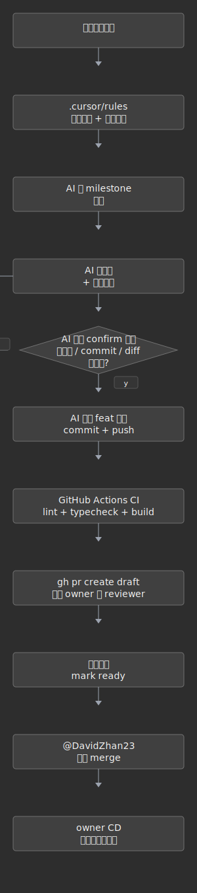

# 文档中心

健身打卡 PWA 的文档入口。**人类开发者**与 **Cursor** 都从这里开始。

## 我该读哪份？

| 你是谁 | 第一步 | 然后 |
|--------|--------|------|
| **新开发者** | [GETTING-START.md](GETTING-START.md) | [../CONTRIBUTING.md](../CONTRIBUTING.md) |
| **在 Cursor 里做功能** | [ai-playbook.md](ai-playbook.md) | 当前功能的 [milestones/](milestones/) |
| **提需求 / 看待办** | [requirements/README.md](requirements/README.md) | `npm run req:list` |
| **改 API / 表结构** | [architecture/api-contract.md](architecture/api-contract.md) | [architecture/overview.md](architecture/overview.md) |
| **CI 失败 / 部署** | [architecture/deploy-pipeline.md](architecture/deploy-pipeline.md) | [ops/README.md](ops/README.md) |
| **Owner 合码与上线** | [architecture/owner-setup-guide.md](architecture/owner-setup-guide.md) | ADR [0002](decisions/0002-owner-gates-merge.md) |

## 端到端流程

Issue 侧简图：[issue-to-merge.svg](assets/diagrams/issue-to-merge.svg)。状态：`status:todo` → PR `Closes #N` → merge 关闭。

### 文档里的图

- **预览**：打开 md → **`Cmd+Shift+V`**
- **改图**：编辑 `docs/assets/diagrams/*.mmd`（深色极简竖向流）→ `npm run diagrams:regen`
- **Mermaid 实时渲染**：[guides/markdown-diagrams.md](guides/markdown-diagrams.md)

## 文档地图

### 协作与 AI

| 文档 | 用途 |
|------|------|
| [guides/markdown-diagrams.md](guides/markdown-diagrams.md) | 配图 / Mermaid 预览 |
| [GETTING-START.md](GETTING-START.md) | 本地开发入门 |
| [../CONTRIBUTING.md](../CONTRIBUTING.md) | 分支、PR、CI |
| [ai-playbook.md](ai-playbook.md) | Cursor 协作 |
| [milestones/](milestones/) | 功能规格 |
| [requirements/](requirements/) | GitHub 需求 |

### 架构与契约

| 文档 | 何时读 |
|------|--------|
| [architecture/overview.md](architecture/overview.md) | 主流程图 + 系统概要 |
| [architecture/api-contract.md](architecture/api-contract.md) | 改 API |
| [architecture/deploy-pipeline.md](architecture/deploy-pipeline.md) | CI/CD |
| [architecture/owner-setup-guide.md](architecture/owner-setup-guide.md) | 自动部署 |

### 决策 · 运维

[decisions/README.md](decisions/README.md) · [ops/README.md](ops/README.md)

## Cursor 口令

| 你说 | AI 应做 |
|------|---------|
| 列我的待办 | `npm run req:list` |
| 开始 #12 | 读 issue → 澄清 → milestone → `new-feature.sh` |
| 准备提交 | confirm 摘要，等你 `go` 再 `ai-flow.sh` |
