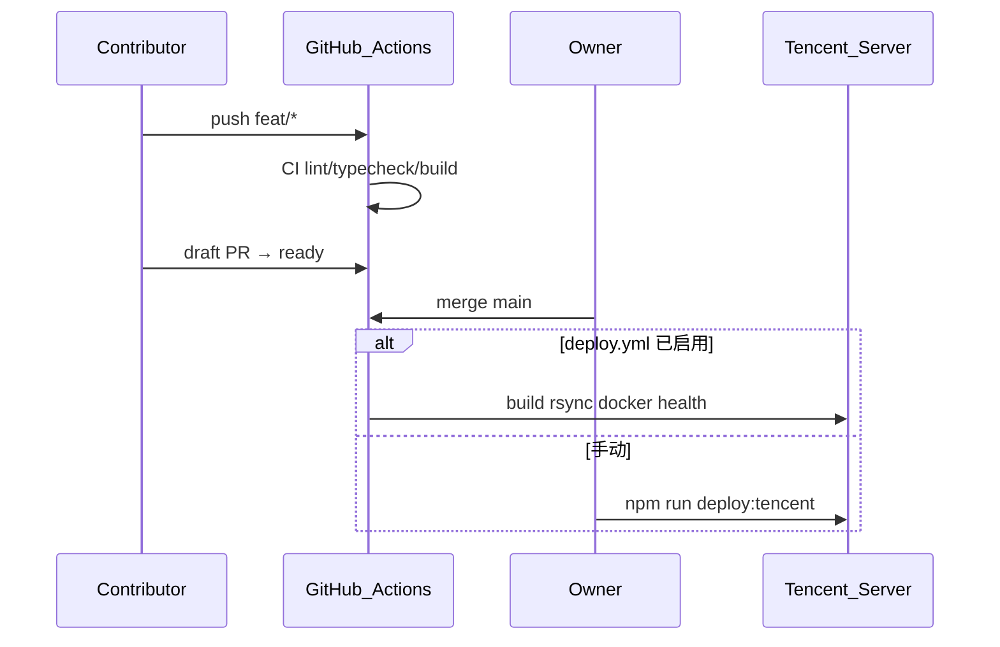

# 部署与 CI/CD 流水线

## 时序（目标状态）



## CI Jobs 速查

| Job | 做什么 | 常见失败 | 处理 |
|-----|--------|----------|------|
| lint | `npm run lint` | ESLint 报错 | 本地 `npm run lint` 修复 |
| typecheck | `tsc -b --noEmit` | 类型错误 | 本地 `npm run typecheck` |
| build | `npm run build` | TS/资源错误 | 本地 `npm run build` |
| server-syntax | `node --check` | 语法错误 | 检查 `server/src/*.js` |

## 观察进度

| 角色 | CI（feat/PR） | CD（main merge） |
|------|---------------|------------------|
| Contributor | PR Checks、`gh run watch`、终端链接 Cmd+Click | 看 Actions → Deploy 或 README 徽章 |
| Owner | 同左 | Actions → Deploy 日志 |

## Deploy Secrets（owner 配置）

| Secret | 用途 |
|--------|------|
| `TENCENT_SSH_KEY` | 部署专用私钥 |
| `TENCENT_HOST` | 公网 IP |
| `TENCENT_USER` | SSH 用户，通常 `root` |
| `TENCENT_REMOTE_DIR` | 通常 `/opt/fitness-app` |

启用步骤：[owner-setup-guide.md](owner-setup-guide.md)。

## 手动部署（现有）

```bash
cp .env.deploy.example .env.deploy
npm run deploy:tencent        # 仅前端
npm run deploy:tencent:api    # 前端 + API
```

## 手动触发 Deploy workflow

GitHub → Actions → Deploy → **Run workflow**（需已存在 `deploy.yml`）。

## 失败排查

1. **SSH 失败** — 检查 Secret、公钥在服务器 `authorized_keys`、安全组 22  
2. **docker compose 失败** — SSH 登录后 `cd /opt/fitness-app/deploy && docker compose ps`  
3. **health check 失败** — 服务器 `curl http://127.0.0.1/api/health`；查 `deploy/.env`、postgres/api 容器  

## 回滚（releases 目录）

Deploy workflow 将每次 `dist` 存到 `/opt/fitness-app/releases/<sha>/dist`，当前链到 `/opt/fitness-app/dist`。

```bash
# 在服务器上（示例）
cd /opt/fitness-app/releases
ls -t   # 找上一个 sha
ln -sfn /opt/fitness-app/releases/<prev-sha>/dist /opt/fitness-app/dist
cd /opt/fitness-app/deploy && docker compose restart web
```

保留最近 3 个 release；更老的由 workflow 自动清理。
