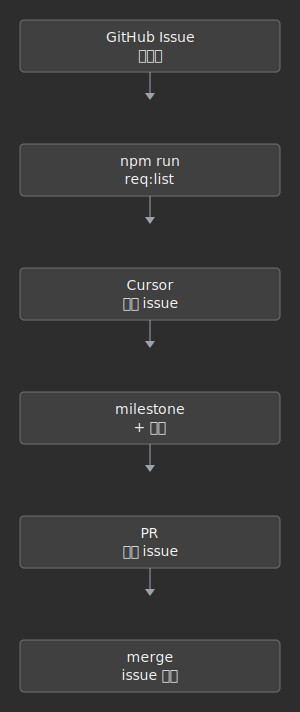

# 架构总览

> 导航：[文档中心](../README.md) · [API 契约](api-contract.md) · [部署说明](deploy.md)

## 开发协作流程

与 [ai-playbook.md](../ai-playbook.md) 一致的主流程（深色极简图，`Cmd+Shift+V` 预览）：

## 从 Issue 到合并（简图）

## 1. 系统架构

- **生产**：PWA → 腾讯云 Nginx :80 → Node API :3001 → PostgreSQL  
- **本地**：Vite :5173 → `server npm run dev` → 本机 PostgreSQL  

## 2. 用户主流程

注册/登录 → 身体资料（BMR/TDEE）→ 记录运动/饮食 → 当日缺口 → 打卡墙 → 社区（可选）

## 3. 数据模型（核心）

完整 DDL 见 `server/migrations/`（按文件名顺序执行）。

### 3.1 ER 概览

| 表名 | 说明 | 主要外键 |
|------|------|---------|
| `users` | 账号（email + password_hash） | — |
| `profiles` | 身体指标（含 `birthday`）+ 社区开关 + `wall_style`（打卡墙 classic/split）+ `metabolism_mode`（基础代谢全天计入/随时间累计） | `id → users.id` |
| `day_logs` | 每日打卡汇总（deficit 由触发器计算）；含 `community_visible`（当日动态是否对他人公开，默认 true） | `user_id → users.id` |
| `exercises` | 单条运动记录 | `day_log_id → day_logs.id`，`user_id → users.id` |
| `meals` | 单条饮食记录 | `day_log_id → day_logs.id`，`user_id → users.id` |
| `exercise_templates` | 用户运动模板 | `user_id → users.id` |
| `meal_templates` | 用户饮食模板 | `user_id → users.id` |
| `follows` | 关注关系 | `follower_id / followee_id → users.id` |
| `day_likes` | 对某天打卡点赞 | `liker_id / target_user_id → users.id` |
| `day_comments` | 对某天打卡评论（含回复） | `author_id / target_user_id → users.id`；`parent_comment_id → day_comments.id` |
| `day_comment_likes` | 对评论点赞 | `comment_id → day_comments.id`；`liker_id → users.id` |
| `community_member_order` | 每位用户自定义社区列表顺序 | `viewer_id / member_id → users.id` |
| `log_item_reactions` | 对单条运动/饮食点赞或点踩（+1/-1） | `voter_id / owner_user_id → users.id` |
| `telemetry_events` | 前端轻量埋点（路由切换、页面加载、AI 估算成功/超时/错误/fallback 完成）；含 `session_id` / `app_version` / `commit_sha` 上下文列 | `user_id → users.id`（可空，登录上报）|
| `weekly_reports` | 每周自动聚合的质量周报（metrics_json、AI 解读 markdown、完整 report_md、status draft/final） | — |
| `user_weekly_reports` | 用户上一自然周的运动、饮食、缺口、成就与小狸文案快照；含已读状态 | `user_id → users.id` |
| `profiles.community_notify_seen_at` | 通知已读时间戳（profiles 列） | — |

### 3.2 社区可见性规则

**列表候选（`GET /community/members`）**：`profiles.community_visible = true` 且 `onboarding_complete = true`（见 `server/src/community.js#listCommunityMembers`）。

**Onboarding 完成**：`PATCH /profile` 将 `onboarding_complete` 设为 `true` 时，若请求未显式传 `community_visible`，默认写入 `community_visible = true`（`server/src/profilePatch.js`）。显式 `community_visible: false` 时不覆盖。

**近日记录自动打开**（`server/src/communityVisibility.js#syncCommunityVisibility`，日记录变更后触发）：

1. **今日或昨日任一有运动/饮食记录** → `profiles.community_visible = true`（仅 auto-open，不 auto-close）
2. 账号创建当日：若创建时间晚于「昨日」基准，则跳过昨日判断，仅看今日
3. 调用入口：`server/src/dayLogMutation.js#afterDayLogChanged`

**历史回填**：迁移 `023_backfill_community_visible_onboarded.sql` 将已 onboarding 但未公开的用户设为公开。

### 3.3 当日社区动态可见（per-day）

- 列：`day_logs.community_visible`（迁移 `016_day_logs_visible.sql`）
- API：`PATCH /community/days/:date/visible`，body `{ visible: boolean }`，仅本人
- 列表：`GET /community/members` 的 `today.dayCommunityVisible` / `today.hidden`；对他人隐藏时展示「今日已隐藏」，本人仍可见自己的缺口
- UI：社区页顶栏切换「今日公开/隐藏」（与 `profiles.community_visible` 总开关独立）

## 更多

- 部署说明：[deploy.md](deploy.md)  
- 需求入口：[requirements/README.md](../requirements/README.md)  
- 改图：`docs/assets/diagrams/*.mmd` → `npm run diagrams:regen`
- 数据库迁移：新增 `server/migrations/NNN_*.sql` 后，API 启动会自动执行未应用 migration（记录在 `public.schema_migrations`）
