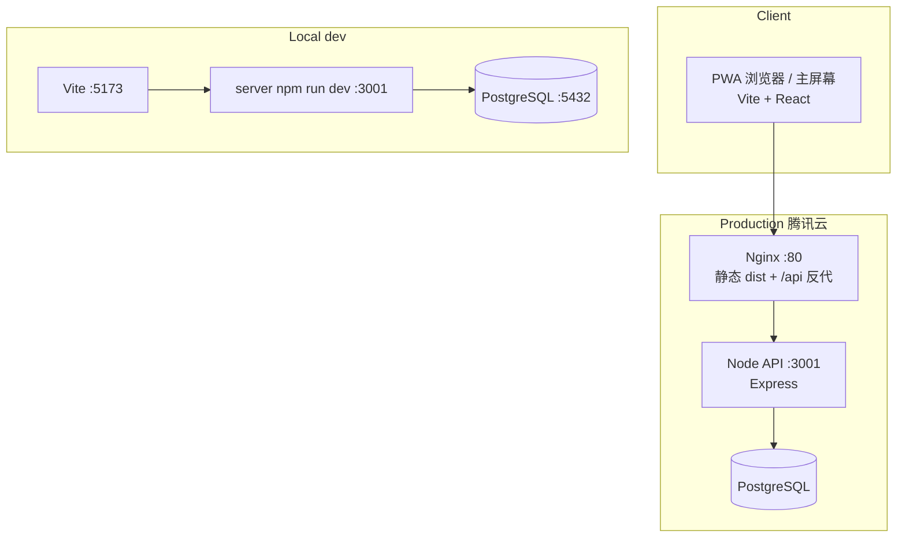
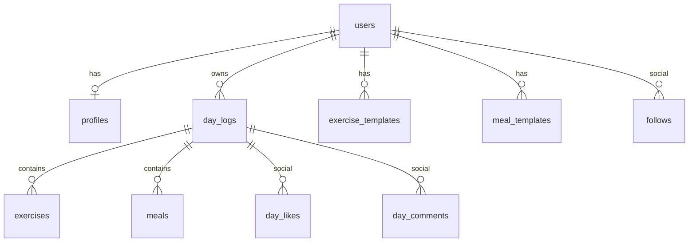
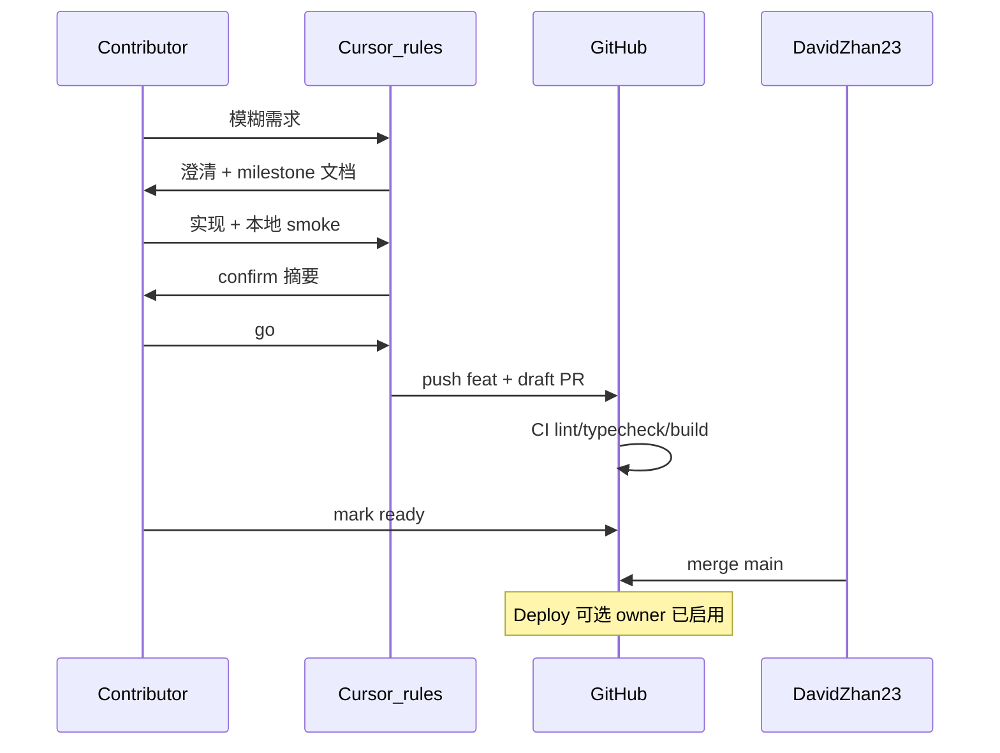

# 架构总览

## 1. 系统架构

## 2. 用户主流程

## 3. 数据模型（核心表）

另有：`community_member_order`、`log_item_reactions` 等，见 `server/migrations/`。

## 4. 贡献者工作流

详见 [deploy-pipeline.md](deploy-pipeline.md) 与 [../CONTRIBUTING.md](../../CONTRIBUTING.md)。
